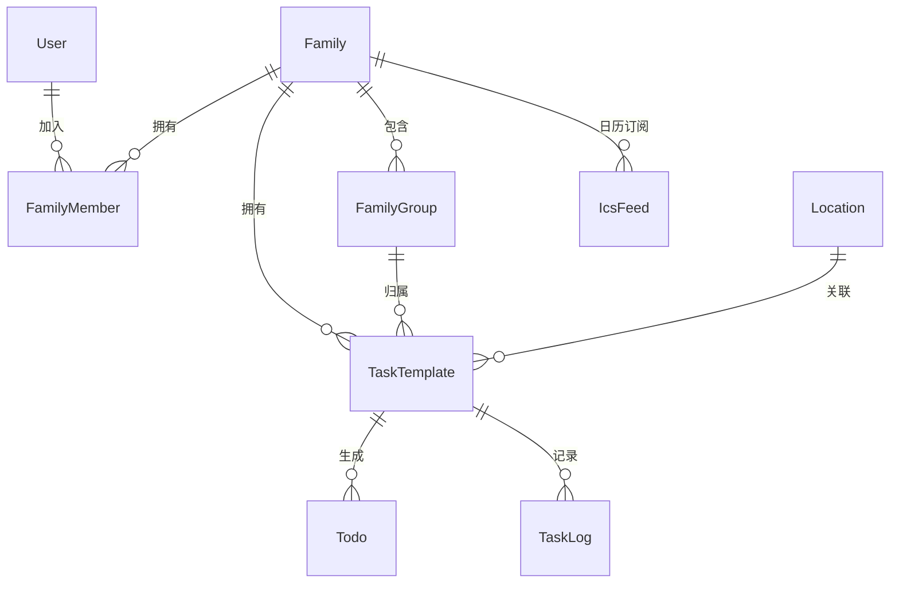

# Now & Again

> *"Life is just a mix of 'Now' (one-off) and 'Again' (recurring)."*
>
> 家庭事务管理平台 — Web UI + CLI + RESTful API，三端统一。

[](https://opensource.org/licenses/MIT)
[](https://golang.org/)
[](https://vuejs.org/)
[](https://pnpm.io/)

---

## 📖 名字的由来

生活中的琐事只有两种：

- **Now（此刻）**：临时起意、只做一次的事 — 取快递、给绿植换盆、预约体检。
- **Again（再次）**：循环往复、刻在生活节律里的事 — 每两周换四件套、每天铲猫砂、每月大扫除。

**Now & Again** 把它们统一管理起来，让你无论在手机、电脑还是命令行终端，都能随手处理这些生活碎片。

---

## 🧩 数据模型一览



> 共 18 张表，涵盖任务调度、巡检、ICS 日历订阅、API Key 权限体系。详见 [数据库文档](doc/database/schema.md)。

---

## 🚧 开发状态

> 项目处于早期开发阶段，以下为各模块完成度。

| 模块 | 状态 | 说明 |
|------|------|------|
| 🗄️ 数据模型 | ✅ 完成 | 18 张表，GORM AutoMigrate |
| 🔐 认证体系 | ✅ 完成 | JWT + Refresh Token + API Key（带 Scope 权限控制） |
| 👤 用户管理 | ✅ 完成 | 注册/登录/管理员面板 |
| 👨‍👩‍👧 家庭管理 | ✅ 完成 | 创建/加入/邀请码/成员管理 |
| 👥 小组管理 | ✅ 完成 | 创建/加入/审核/成员管理 |
| 🏠 户型图 | ✅ 完成 | 多楼层上传/地点标记/颜色标注 |
| 🔧 任务调度 | ✅ 完成 | Gocron 引擎，支持 once/daily/weekly/monthly/interval |
| 📋 任务系统 | ✅ 完成 | 统一模型：simple（普通）/ branched（分支），支持跟进 |
| ✅ 待办管理 | ✅ 完成 | 时间窗口、完成/跳过、分支选择 |
| 📅 ICS 订阅 | ✅ 完成 | 标准 iCalendar，API Key/Basic Auth，导入日历 App |
| 🖥️ Web 前端 | ✅ 完成 | Vue 3 + i18n 中英文 + 暗色模式 |
| 💻 CLI 工具 | ⚠️ 框架 | 命令定义完成，API 调用待对接 |
| 🐳 Docker | ✅ 完成 | 多阶段构建，GitHub Actions 推送到 GHCR |
| 📱 移动端 | ❌ 未开始 | — |

---

## ✨ 核心特性

| 特性 | 说明 |
|------|------|
| 🔀 **Now & Again 双模式** | 一次性任务完成后归档；周期性任务完成后自动计算下次到期日并重置 |
| 🔗 **事项链** | 支持"先 A → 再 B → 再 C"的流程模板，一键启动整套流程 |
| 🔍 **巡检驱动** | 例行巡检发现问题（猫砂不够）→ 自动生成采购任务 |
| 👥 **家庭 + 小组分工** | 家庭成员可创建子小组（厨房组、清洁组），任务精确指派到组或个人 |
| 📋 **完整操作日志** | 全程记录：创建 / 分配 / 开始 / 完成 / 重置 / 评论 |
| 🔔 **多渠道通知** | Email · Push · 企业微信机器人 · 自定义 Webhook，支持免打扰时段 |
| 🧩 **开闭原则** | 新增任务类型 / 通知渠道只需注册 + 一行配置，核心代码零改动 |
| 🖥️ **三入口统一** | Web (Vue 3) · CLI (Cobra) · RESTful API — 共享同一后端和数据契约 |
| 🤖 **CLI JSON 输出** | 原生支持 `--output json`，方便集成到 Alfred、Raycast、Hermes 等工具链 |

---

## 🏗️ 项目结构

```
now-and-again/
├── backend/                    # Go 后端 — Gin + GORM + Gocron
│   ├── cmd/server/main.go      #   入口
│   └── internal/
│       ├── config/             #   环境变量配置
│       ├── handler/            #   HTTP 路由 + 请求处理
│       ├── middleware/          #   JWT · API Key · Scope 鉴权
│       ├── repository/         #   GORM 模型 · 迁移 · 种子数据
│       ├── service/            #   业务逻辑层
│       ├── scheduler/          #   Gocron 调度引擎（可插拔 Handler）
│       └── logger/             #   Zap 日志（按日切割 + 压缩）
│
├── frontend/                   # Vue 3 + TypeScript + Vite + pnpm
│   └── src/
│       ├── api/client.ts       #   HTTP 客户端
│       ├── router/             #   Vue Router 路由定义
│       ├── stores/             #   Pinia 状态管理
│       ├── types/              #   TypeScript 类型（与 Go 共享层对齐）
│       ├── views/              #   页面组件
│       └── components/         #   可复用组件
│
├── cli/                        # Go CLI — Cobra + Viper
│   ├── cmd/                    #   命令定义 (task/chain/inspect/family/login)
│   └── internal/
│       ├── client/             #   HTTP API 客户端（对接 backend）
│       ├── config/             #   配置管理 (~/.na.yaml)
│       └── output/             #   格式化输出 (table / json)
│
├── shared/                     # 共享 Go module — backend 与 CLI 的唯一耦合点
│   └── types/                  #   DTO 定义 (json + binding tags)
│
├── doc/                        # 文档
│   ├── architecture/overview.md
│   ├── api/endpoints.md
│   └── database/schema.md
│
├── COUPLING.md                 # ⚠️ Backend ↔ CLI 联动契约（vibecoding 前必读）
├── .gitignore
└── README.md
```

---

## 🚀 快速开始

### 前置要求

| 工具 | 版本 | 用途 |
|------|------|------|
| Go | ≥ 1.22 | Backend + CLI |
| Node.js | ≥ 18 | Frontend 运行时 |
| pnpm | ≥ 9 | Frontend 包管理 |

### 一键启动

```bash
git clone <repo-url> && cd now-and-again

# ── Terminal 1: 后端 ──────────────────────────────────────
cd backend
go run ./cmd/server
# ✅ 监听 :8080 | 自动建表 + 种子数据 | 默认 SQLite

# ── Terminal 2: 前端 ──────────────────────────────────────
cd frontend
pnpm install
pnpm run dev
# ✅ 监听 :5173 | API 自动代理到 :8080

# ── Terminal 3: CLI ───────────────────────────────────────
cd cli
go run . login -u <username> -p <password>
go run . family create --name "我的家"
go run . task create --family-id <id> --title "取快递" --type chore_general
```

### 环境变量

| 变量 | 默认值 | 说明 |
|------|--------|------|
| `PORT` | `8080` | 后端监听端口 |
| `JWT_SECRET` | (dev default) | JWT 签名密钥，生产环境务必修改 |
| `DB_DRIVER` | `sqlite` | 数据库驱动：`sqlite` 或 `postgres` |
| `DB_DSN` | `now-and-again.db` | 数据库连接串 |
| `NA_TOKEN` | — | CLI 的 API Token（也可通过 `na login` 写入 `~/.na.yaml`） |

---

## 🔧 开发工作流

### Contract-First 开发

```
  1. shared/types  ← 先定义数据契约（DTO）
         │
  2. backend        ← 实现 API + 业务逻辑
         │
  3. CLI            ← 对接 API，验证契约
         │
  4. frontend       ← UI 展示与交互
```

> ⚠️ **修改 `shared/types` 时**，必须同步更新 `backend/handler`、`cli/cmd`、`frontend/src/types`。
> 详见 [COUPLING.md](./COUPLING.md) 中的完整 checklist。

### 新增任务类型（开闭原则）

```bash
# 只需在 Seed() 中添加一行，无需改任何核心代码：
# backend/internal/repository/db.go → Seed() 函数
{Code: "chore_gardening", Name: "园艺养护", Category: "again", ...}
```

### 新增通知渠道

```go
// 1. 在 backend/internal/notifier/ 下创建文件，实现 Notifier 接口
// 2. 在 init() 中调用 RegisterNotifier()
// 3. 在 Seed() 中添加 notification_channels 行
```

---

## 📚 文档索引

| 文档 | 说明 |
|------|------|
| [架构设计](doc/architecture/overview.md) | 系统架构、设计原则、数据流、部署方式 |
| [API 文档](doc/api/endpoints.md) | 完整 RESTful API 路由表（51 个端点） |
| [数据库 Schema](doc/database/schema.md) | 20 张表结构、索引策略、调度类型 |
| [联动说明](COUPLING.md) | ⚠️ Backend ↔ CLI 耦合点及修改 checklist |

---

## 📄 License

MIT © Now & Again Contributors
