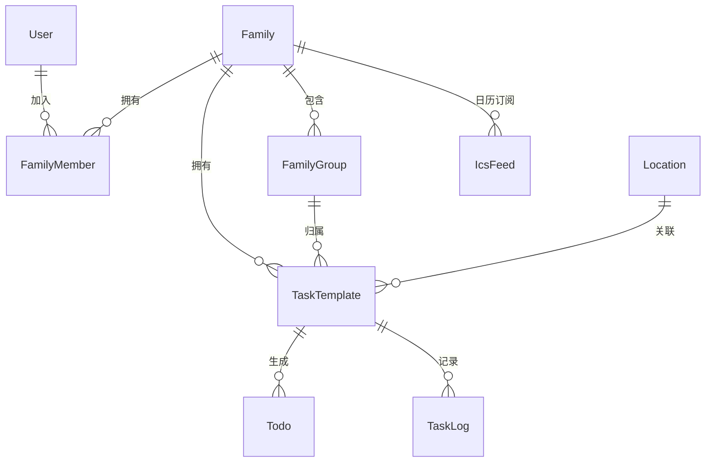

# Now & Again

> *"Life is just a mix of 'Now' (one-off) and 'Again' (recurring)."*
>
> 家庭事务管理平台 — Web UI + CLI + RESTful API，三端统一。

[](https://opensource.org/licenses/MIT)
[](https://golang.org/)
[](https://vuejs.org/)
[](https://pnpm.io/)

---

## 📖 名字的由来

生活中的琐事只有两种：

- **Now（此刻）**：临时起意、只做一次的事 — 取快递、给绿植换盆、预约体检。
- **Again（再次）**：循环往复、刻在生活节律里的事 — 每两周换四件套、每天铲猫砂、每月大扫除。

**Now & Again** 把它们统一管理起来，让你无论在手机、电脑还是命令行终端，都能随手处理这些生活碎片。

---

## 🧩 数据模型一览



> 共 18 张表，涵盖任务调度、巡检、ICS 日历订阅、API Key 权限体系。详见 [数据库文档](doc/database/schema.md)。

---

## 🚧 开发状态

> 项目处于早期开发阶段，以下为各模块完成度。

| 模块 | 状态 | 说明 |
|------|------|------|
| 🗄️ 数据模型 | ✅ 完成 | 18 张表，GORM AutoMigrate |
| 🔐 认证体系 | ✅ 完成 | JWT + Refresh Token + API Key（带 Scope 权限控制） |
| 👤 用户管理 | ✅ 完成 | 注册/登录/管理员面板 |
| 👨‍👩‍👧 家庭管理 | ✅ 完成 | 创建/加入/邀请码/成员管理 |
| 👥 小组管理 | ✅ 完成 | 创建/加入/审核/成员管理 |
| 🏠 户型图 | ✅ 完成 | 多楼层上传/地点标记/颜色标注 |
| 🔧 任务调度 | ✅ 完成 | Gocron 引擎，支持 once/daily/weekly/monthly/interval |
| 📋 任务系统 | ✅ 完成 | simple（普通）/ inspection（巡检），巡检发现问题自动生成跟进任务 |
| ✅ 待办管理 | ✅ 完成 | 时间窗口、完成/跳过、巡检分支选择 |
| 📊 统计分析 | ✅ 完成 | 按周/月/年统计完成率，图表可视化 |
| 📅 ICS 订阅 | ✅ 完成 | 标准 iCalendar，API Key/Basic Auth，导入日历 App |
| 🖥️ 日历大屏 | ✅ 完成 | `<embed>` 标签嵌入，支持 URL 参数配置刷新间隔 |
| 🖥️ Web 前端 | ✅ 完成 | Vue 3 + i18n 中英文 + 暗色模式 |
| 💻 CLI 工具 | ⚠️ 开发中 | 命令框架完成，部分 API 调用待对接 |
| 🐳 Docker | ✅ 完成 | 多阶段构建，GitHub Actions 推送到 GHCR |
| 📱 移动端 | ❌ 未开始 | — |

---

## ✨ 核心特性

| 特性 | 说明 |
|------|------|
| 🔀 **Now & Again 双模式** | 一次性任务完成后归档；周期性任务完成后自动计算下次到期日并重置 |
| � **巡检驱动** | 例行巡检发现问题（如漏水）→ 自动生成跟进任务 |
| 👥 **家庭 + 小组分工** | 家庭成员可创建子小组（厨房组、清洁组），任务精确指派到组或个人 |
| 📋 **完整操作日志** | 全程记录：创建 / 分配 / 开始 / 完成 / 重置 / 评论 |
| 🧩 **开闭原则** | 新增任务类型只需注册插件，核心代码零改动 |
| 🖥️ **三入口统一** | Web (Vue 3) · CLI (Cobra) · RESTful API — 共享同一后端和数据契约 |
| 📅 **ICS 日历订阅** | 标准 iCalendar 协议，支持 API Key/Basic Auth，可导入任意日历 App |
| 🖥️ **大屏日历嵌入** | 生成 `<embed>` 标签，嵌入任意网页展示家庭日历，支持自动刷新 |
| 🔑 **API Key 权限体系** | 细粒度 Scope 控制（read/write/admin），适合 CLI 和外部集成 |
| 🌙 **暗色模式 + i18n** | 支持中英文切换 + 暗色/亮色主题 |

---

## 🏗️ 项目结构

```
now-and-again/
├── backend/                    # Go 后端 — Gin + GORM + Gocron
│   ├── cmd/server/main.go      #   入口
│   ├── pkg/                    #   公共包（CLI 可直接引用）
│   │   ├── contracts/          #     API 接口定义
│   │   ├── scheduler/          #     调度引擎（可插拔 Handler）
│   │   ├── taskkind/           #     任务类型插件（simple, inspection）
│   │   ├── scopes/             #     权限范围
│   │   └── types/              #     共享 DTO
│   └── internal/
│       ├── config/             #   环境变量配置
│       ├── handler/            #   HTTP 路由 + 请求处理 (10 files)
│       ├── middleware/          #   JWT · API Key · Scope 鉴权
│       ├── repository/         #   GORM 模型 · 迁移 · 种子数据 (12 files)
│       ├── service/            #   业务逻辑层 (8 files)
│       └── logger/             #   Zap 日志（按日切割 + 压缩）
│
├── frontend/                   # Vue 3 + TypeScript + Vite + pnpm
│   └── src/
│       ├── api/client.ts       #   HTTP 客户端
│       ├── router/             #   Vue Router 路由定义
│       ├── stores/             #   Pinia 状态管理
│       ├── types/              #   TypeScript 类型
│       ├── i18n/               #   国际化（zh-CN, en）
│       ├── composables/        #   组合式函数
│       ├── views/              #   页面组件 (12 views)
│       └── components/         #   可复用组件
│
├── cli/                        # Go CLI — Cobra + Viper
│   ├── cmd/                    #   命令定义
│   └── internal/
│       ├── client/             #   HTTP API 客户端
│       ├── config/             #   配置管理
│       └── output/             #   格式化输出 (table / json)
│
├── doc/                        # 文档
│   ├── deployment/docker.md    #   Docker 部署指南
│   ├── architecture/overview.md
│   ├── api/endpoints.md
│   └── database/schema.md
│
├── data/                       # 运行时数据（SQLite + 上传文件）
├── docker-compose.yml
├── Dockerfile
├── Makefile
└── README.md
```

---

## 🚀 快速开始

### 前置要求

| 工具 | 版本 | 用途 |
|------|------|------|
| Go | ≥ 1.22 | Backend + CLI |
| Node.js | ≥ 18 | Frontend 运行时 |
| pnpm | ≥ 9 | Frontend 包管理 |

### 一键启动

```bash
git clone <repo-url> && cd now-and-again

# ── Terminal 1: 后端 ──────────────────────────────────────
cd backend
go run ./cmd/server
# ✅ 监听 :8080 | 自动建表 + 种子数据 | 默认 SQLite

# ── Terminal 2: 前端 ──────────────────────────────────────
cd frontend
pnpm install
pnpm run dev
# ✅ 监听 :5173 | API 自动代理到 :8080

# ── Terminal 3: CLI ───────────────────────────────────────
cd cli
go run . login -u <username> -p <password>
go run . family create --name "我的家"
go run . task create --family-id <id> --title "取快递" --type chore_general
```

### 环境变量

> 📄 完整模板见 [`.env.example`](.env.example)，可复制为 `.env` 使用。

| 变量 | 默认值 | 说明 |
|------|--------|------|
| `PORT` | `8080` | 后端 HTTP 监听端口 |
| `JWT_SECRET` | (自动生成) | JWT 签名密钥。未设置时自动生成并持久化到 `$DATA_DIR/.jwt_secret` |
| `ADMIN_DEFAULT_PASSWORD` | (随机生成) | 首次运行时默认管理员密码，仅未初始化时生效 |
| `DB_DRIVER` | `sqlite` | 数据库驱动：`sqlite` 或 `postgres` |
| `DB_DSN` | — | PostgreSQL 连接串（仅 `DB_DRIVER=postgres` 时需要） |
| `DATA_DIR` | `./data` | 数据根目录，数据库、上传文件、日志均存放于此 |
| `GIN_MODE` | `debug` | Gin 运行模式：`debug`（开发）/ `release`（生产）/ `test` |


#### 快速配置

```bash
# 方式一：环境变量
export JWT_SECRET="$(openssl rand -base64 64)"
export ADMIN_DEFAULT_PASSWORD="my-secure-password"
export GIN_MODE=release
go run ./cmd/server

# 方式二：使用 .env 文件
cp .env.example .env
# 编辑 .env 填入实际值
export $(cat .env | xargs) && go run ./cmd/server
```

#### PostgreSQL 配置示例

```bash
export DB_DRIVER=postgres
export DB_DSN="host=localhost user=postgres password=xxx dbname=now_and_again port=5432 sslmode=disable"
```

---

## 🔧 开发工作流

### 新增任务类型（开闭原则）

```go
// 在 backend/pkg/taskkind/ 下创建新包，实现 TaskKind 接口
// 注册后自动获得路由、调度、待办生成等能力
// 示例：backend/pkg/taskkind/inspection/ — 巡检任务类型
```

---

## 📚 文档索引

| 文档 | 说明 |
|------|------|
| [Docker 部署](doc/deployment/docker.md) | Docker 一键部署、环境变量、数据持久化、PostgreSQL |
| [架构设计](doc/architecture/overview.md) | 系统架构、设计原则、数据流、部署方式 |
| [API 文档](doc/api/endpoints.md) | 完整 RESTful API 路由表（60+ 个端点） |
| [数据库 Schema](doc/database/schema.md) | 18 张表结构、索引策略 |

---

## 📄 License

MIT © Now & Again Contributors
