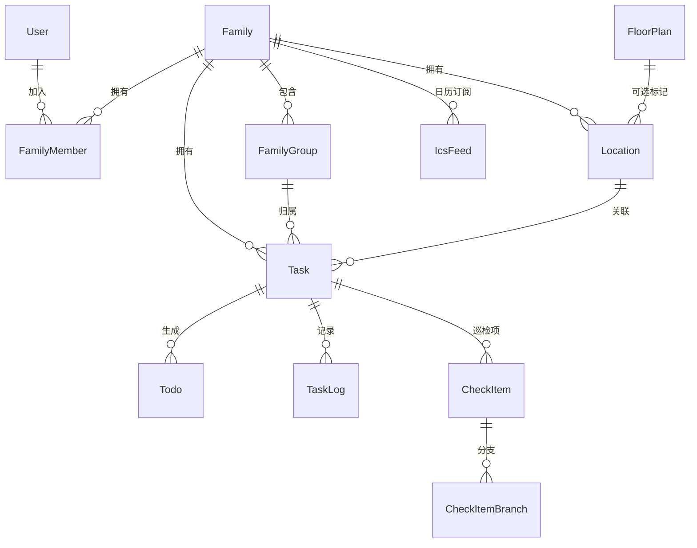

# Now & Again

> *"Life is just a mix of 'Now' (one-off) and 'Again' (recurring)."*
>
> 家庭事务管理平台 — Web UI + CLI + RESTful API，三端统一。

[](https://opensource.org/licenses/MIT)
[](https://golang.org/)
[](https://vuejs.org/)
[](https://www.typescriptlang.org/)
[](https://tailwindcss.com/)
[](https://pnpm.io/)
[](https://www.docker.com/)
[](https://sqlite.org/)
<br>
[](https://github.com/dezhishen/now-and-again)
[](https://github.com/dezhishen/now-and-again)
[](https://github.com/dezhishen/now-and-again/actions)
[](https://github.com/dezhishen/now-and-again/releases)
[](https://github.com/dezhishen/now-and-again/issues)
[](https://github.com/dezhishen/now-and-again/pulls)

---

## 📖 名字的由来

生活中的琐事只有两种：

- **Now（此刻）**：临时起意、只做一次的事 — 取快递、给绿植换盆、预约体检。
- **Again（再次）**：循环往复、刻在生活节律里的事 — 每两周换四件套、每天铲猫砂、每月大扫除。

**Now & Again** 把它们统一管理起来，让你无论在手机、电脑还是命令行终端，都能随手处理这些生活碎片。

---

## 🧩 数据模型一览



> 共 21 张表，涵盖任务调度、巡检、地点管理、ICS 日历订阅、API Key 权限体系。详见 [数据库文档](doc/database/schema.md)。

---

## 🚧 开发状态

> 项目处于早期开发阶段，未发布正式版本。

| 模块 | 状态 | 说明 |
|------|------|------|
| 🗄️ 数据模型 | ✅ 完成 | 21 张表，GORM AutoMigrate |
| 🔐 认证体系 | ✅ 完成 | JWT + Refresh Token + API Key（Scope 权限控制） |
| 👤 用户管理 | ✅ 完成 | 注册/登录/个人中心/管理员面板 |
| 👨‍👩‍👧 家庭管理 | ✅ 完成 | 创建/加入/邀请码/成员管理/审核 |
| 👥 小组管理 | ✅ 完成 | 创建/加入/审核/成员管理 |
| 📍 地点管理 | ✅ 完成 | 一级实体 + locationkind 插件系统(indoor)，可选关联户型图 |
| 🏠 户型图 | ✅ 完成 | 多楼层上传/Canvas绘制/地点关联 |
| 🔧 任务调度 | ✅ 完成 | Gocron 引擎，once/daily/weekly/monthly/interval |
| 📋 任务系统 | ✅ 完成 | taskkind 插件系统(simple/inspection)，巡检异常自动生成跟进任务 |
| ✅ 待办管理 | ✅ 完成 | 快速完成/备注完成/跳过，巡检分支选择 |
| 📅 ICS 订阅 | ✅ 完成 | 标准 iCalendar，API Key/Basic Auth，可导入日历 App |
| 🖥️ 日历大屏 | ✅ 完成 | embed 标签嵌入，支持自动刷新 |
| 🖥️ Web 前端 | ✅ 完成 | Vue 3 + i18n 中英文 + 暗色模式 + 自适应布局 |
| 💻 CLI 工具 | ⚠️ 开发中 | 命令框架完成，部分 API 待对接 |
| 🐳 Docker | ✅ 完成 | 多阶段构建，GitHub Actions 推送到 GHCR |
| 📱 移动端 | ❌ 未开始 | — |

---

## ✨ 核心特性

| 特性 | 说明 |
|------|------|
| 🔀 **Now & Again 双模式** | 一次性任务完成后归档；周期性任务自动计算下次到期日 |
| 🔍 **巡检驱动** | 检查项→分支→异常自动创建跟进子任务（可指定地点/小组） |
| 🧩 **插件化架构** | 任务类型(taskkind) + 地点类型(locationkind) 双插件系统，新增类型零侵入 |
| 📍 **地点独立管理** | 地点为一级实体，不强制绑定户型图，支持室内/户外等多种类型 |
| 👥 **家庭 + 小组分工** | 任务精确指派到小组/地点，巡检分支可独立配置 |
| 📋 **完整操作日志** | 全程记录创建/完成/跳过/巡检/跟进 |
| 🖥️ **三入口统一** | Web (Vue 3) · CLI (Cobra) · RESTful API — 共享数据契约 |
| 📅 **ICS 日历订阅** | 标准 iCalendar 协议，支持 API Key/Basic Auth |
| 🖥️ **大屏日历嵌入** | 生成 embed 标签嵌入任意网页，支持自动刷新 |
| 🔑 **API Key 权限体系** | 细粒度 Scope 控制 (read/write/admin) |
| 🌙 **暗色模式 + i18n** | 中英文切换 + 暗色/亮色主题 |

---

## 🏗️ 项目结构

```
now-and-again/
├── backend/                    # Go 后端 — Gin + GORM
│   ├── cmd/server/main.go      #   入口
│   ├── pkg/                    #   公共包（CLI 直接引用）
│   │   ├── contracts/          #     API 接口定义
│   │   ├── scheduler/          #     调度引擎
│   │   ├── taskkind/           #     任务类型插件 (simple, inspection)
│   │   ├── locationkind/       #     地点类型插件 (indoor)
│   │   ├── scopes/             #     权限范围
│   │   └── types/         #     共享 DTO (todo.go, log.go, task/{task,inspection}.go)
│   └── internal/
│       ├── config/             #   配置
│       ├── handler/            #   HTTP 路由 + 请求处理
│       ├── middleware/          #   JWT · API Key · Scope 鉴权
│       ├── repository/         #   GORM 模型 · 迁移 · 种子数据
│       ├── service/            #   业务逻辑层
│       └── logger/             #   日志（按日切割 + 压缩）
│
├── frontend/                   # Vue 3 + TypeScript + Vite + pnpm
│   └── src/
│       ├── api/client.ts       #   HTTP 客户端
│       ├── router/             #   Vue Router
│       ├── stores/             #   Pinia 状态管理
│       ├── types/              #   TypeScript 类型
│       ├── i18n/               #   国际化 (zh-CN, en)
│       ├── composables/        #   组合式函数 + 插件注册
│       ├── views/              #   页面组件
│       └── components/         #   可复用组件 (tasks/, locations/)
│
├── cli/                        # Go CLI — Cobra + Viper
│   ├── cmd/                    #   命令定义
│   └── internal/
│       ├── client/             #   HTTP API 客户端
│       ├── config/             #   配置管理
│       └── output/             #   格式化输出 (table / json)
│
├── doc/                        # 文档
│   ├── deployment/docker.md
│   ├── architecture/overview.md
│   ├── api/endpoints.md
│   └── database/schema.md
│
├── .github/agents/             # Copilot 自定义 Agent
│   └── create-task-kind.agent.md
│
├── data/                       # 运行时数据 (SQLite + 上传文件)
├── docker-compose.yml
├── Dockerfile
├── Makefile
└── README.md
```

---

## 🚀 快速开始

### 前置要求

| 工具 | 版本 | 用途 |
|------|------|------|
| Go | ≥ 1.25 | Backend + CLI |
| Node.js | ≥ 18 | Frontend 运行时 |
| pnpm | ≥ 9 | Frontend 包管理 |

### 一键启动

```bash
git clone <repo-url> && cd now-and-again

# Terminal 1: 后端
cd backend && go run ./cmd/server
# ✅ 监听 :8080 | 自动建表 | 默认 SQLite

# Terminal 2: 前端
cd frontend && pnpm install && pnpm run dev
# ✅ 监听 :5173 | API 自动代理到 :8080

# Terminal 3: CLI
cd cli && go run .
```

### 环境变量

| 变量 | 默认值 | 说明 |
|------|--------|------|
| `PORT` | `8080` | 后端 HTTP 监听端口 |
| `JWT_SECRET` | (自动生成) | JWT 签名密钥 |
| `ADMIN_DEFAULT_PASSWORD` | (随机生成) | 首次运行时默认管理员密码 |
| `DB_DRIVER` | `sqlite` | 数据库驱动：`sqlite` / `postgres` |
| `DB_DSN` | — | PostgreSQL 连接串 |
| `DATA_DIR` | `./data` | 数据根目录 |
| `GIN_MODE` | `debug` | Gin 运行模式 |

---

## 📚 文档索引

| 文档 | 说明 |
|------|------|
| [Docker 部署](doc/deployment/docker.md) | Docker 一键部署、数据持久化 |
| [架构设计](doc/architecture/overview.md) | 系统架构、插件系统、分层设计 |
| [API 文档](doc/api/endpoints.md) | 完整 RESTful API 路由表（59 个端点） |
| [数据库 Schema](doc/database/schema.md) | 21 张表结构、索引策略 |

---

## 📄 License

MIT © Now & Again Contributors
