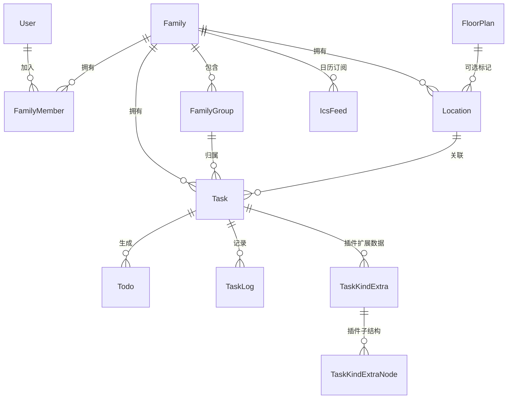

# Now & Again

> *"Life is just a mix of 'Now' (one-off) and 'Again' (recurring)."*
>
> 家庭事务管理平台 — Web UI + CLI + RESTful API，三端统一。

<!-- 技术栈 -->
[](https://opensource.org/licenses/MIT)
[](https://golang.org/)
[](https://vuejs.org/)
[](https://www.typescriptlang.org/)
<br>
<!-- 工具链 -->
[](https://tailwindcss.com/)
[](https://pnpm.io/)
[](https://www.docker.com/)
[](https://sqlite.org/)
<br>
<!-- 项目状态 -->
[](https://github.com/dezhishen/now-and-again)
[](https://github.com/dezhishen/now-and-again)
[](https://github.com/dezhishen/now-and-again/actions)
[](https://github.com/dezhishen/now-and-again/releases)
[](https://github.com/dezhishen/now-and-again/issues)
[](https://github.com/dezhishen/now-and-again/pulls)

---

## 📖 名字的由来

生活中的琐事只有两种：

- **Now（此刻）**：临时起意、只做一次的事 — 取快递、给绿植换盆、预约体检。
- **Again（再次）**：循环往复、刻在生活节律里的事 — 每两周换四件套、每天铲猫砂、每月大扫除。

**Now & Again** 把它们统一管理起来，让你无论在手机、电脑还是命令行终端，都能随手处理这些生活碎片。

---

## 🧩 数据模型一览


```mermaid
erDiagram
    User ||--o{ FamilyMember : "加入"
    Family ||--o{ FamilyMember : "拥有"
    Family ||--o{ FamilyGroup : "包含"
    Family ||--o{ Task : "拥有"
    Family ||--o{ Location : "拥有"
    FamilyGroup ||--o{ Task : "归属"
    Task ||--o{ Todo : "生成"
    Task ||--o{ TaskLog : "记录"
    Location ||--o{ Task : "关联"
    FloorPlan ||--o{ Location : "可选标记"
    Family ||--o{ IcsFeed : "日历订阅"
    Task ||--o{ TaskKindExtra : "插件扩展数据"
    TaskKindExtra ||--o{ TaskKindExtraNode : "插件子结构"
```

> 共 23 张表，涵盖任务调度、巡检、地点管理、ICS 日历订阅、任务模板、API Key 权限体系。
>
> 说明：任务相关的插件子表（如 inspection/chain 的扩展表）在该图中已抽象为 `TaskKindExtra*`，避免主 README 绑定具体插件实现。具体结构请查看：
> - [simple README](backend/pkg/taskkind/simple/README.md)
> - [inspection README](backend/pkg/taskkind/inspection/README.md)
> - [chain README](backend/pkg/taskkind/chain/README.md)
>
> 详见 [数据库文档](doc/database/schema.md)。

---

## 🚧 开发状态

| 模块 | 状态 | 说明 |
|------|------|------|
| 🗄️ 数据模型 | ✅ 完成 | 23 张表，GORM AutoMigrate |
| 🔐 认证体系 | ✅ 完成 | JWT + Refresh Token + API Key（Scope 权限控制） |
| 👤 用户管理 | ✅ 完成 | 注册/登录/个人中心/管理员面板 |
| 👨‍👩‍👧 家庭管理 | ✅ 完成 | 创建/加入/邀请码/成员管理/审核 |
| 👥 小组管理 | ✅ 完成 | 创建/加入/审核/成员管理 |
| 📍 地点管理 | ✅ 完成 | 一级实体 + locationkind 插件系统(indoor)，可选关联户型图 |
| 🏠 户型图 | ✅ 完成 | 多楼层上传/Canvas绘制/地点关联 |
| 🔧 任务调度 | ✅ 完成 | Gocron 引擎，once/daily/weekly/monthly/interval |
| 📋 任务系统 | ✅ 完成 | taskkind 插件系统(simple/inspection/chain)，支持复合任务编排与巡检异常跟进 |
| ✅ 待办管理 | ✅ 完成 | 快速完成/备注完成/跳过，巡检分支选择 |
| 📅 ICS 订阅 | ✅ 完成 | 标准 iCalendar，API Key/Basic Auth，可导入日历 App |
| 🖥️ 日历大屏 | ✅ 完成 | embed 标签嵌入，支持自动刷新 |
| 📋 任务模板 | ✅ 完成 | 插件式 Provider（内置 YAML + HTTP 订阅），系统/家庭双级别 |
| ⚠️ 错误处理 | ✅ 完成 | 统一 ErrorCode + 字段级 details + 前端可折叠 ErrorDisplay |
| 🖥️ Web 前端 | ✅ 完成 | Vue 3 + i18n 中英文 + 暗色模式 + 自适应布局 |
| 💻 CLI 工具 | ✅ 完成 | Cobra 框架，交互式初始化，一键日常，短ID匹配，GitHub Releases 分发 |
| 🧩 Go SDK | ✅ 完成 | 独立模块，高层封装（模板建任务/待办备注/短ID解析），CLI 与外部工具共用 |
| 🤖 AI 助手集成 | ✅ 完成 | OpenClaw 接入，自然语言管理家庭事务 |
| 🐳 Docker | ✅ 完成 | 多阶段构建 + UPX 压缩 (2.9MB)，推送到 GHCR |
| 📱 移动端 | ❌ 未开始 | — |

---

## ✨ 核心特性

| 特性 | 说明 |
|------|------|
| 🔀 **Now & Again 双模式** | 一次性任务完成后归档；周期性任务自动计算下次到期日 |
| 🔍 **巡检驱动** | 检查项→分支→异常自动创建跟进子任务（可指定地点/小组） |
| 📋 **任务模板系统** | 插件式 Provider（内置 YAML + HTTP 远程订阅），Go template 渲染参数，系统/家庭双级别隔离 |
| 🧩 **插件化架构** | 任务类型(taskkind) + 任务模板(tasktemplate) + 调度类型(scheduler) + 地点类型(locationkind) 四插件系统，新增类型零侵入 |
| 🧱 **插件隔离规则** | 主流程只依赖 `taskkind` 公共语义（如 OwnerKind 分发），不依赖插件内部 kind 值与子表结构 |
| 📍 **地点独立管理** | 地点为一级实体，不强制绑定户型图，支持室内/户外等多种类型 |
| 👥 **家庭 + 小组分工** | 任务精确指派到小组/地点，巡检分支可独立配置 |
| 📋 **完整操作日志** | 全程记录创建/完成/跳过/巡检/跟进 |
| 🖥️ **三入口统一** | Web (Vue 3) · CLI (Cobra) · Go SDK · RESTful API — 共享数据契约 |
| 🤖 **AI 助手集成** | OpenClaw 等 AI 框架接入，自然语言管理家庭事务，零命令零代码 |
| 🔐 **API Key 权限** | 细粒度 Scope (read/write/admin)，CLI 自动创建和管理 |
| 📦 **轻量 CLI** | 单二进制 2.9MB（UPX 压缩），GitHub Releases 分发，交互式初始化 |
| 🌙 **暗色模式 + i18n** | 中英文切换 + 暗色/亮色主题 |

---

## 🏗️ 项目结构

```
now-and-again/
├── backend/                    # Go 后端 — Gin + GORM
│   ├── cmd/server/main.go      #   入口
│   ├── pkg/                    #   公共包（CLI 直接引用）
│   │   ├── contracts/          #     API 接口定义
│   │   ├── model/              #     共享 GORM 模型 + 迁移注册表
│   │   ├── scheduler/          #     调度引擎 + 类型注册表
│   │   ├── taskkind/           #     任务类型插件 (simple, inspection)
│   │   ├── tasktemplate/       #     任务模板系统 (内置 + HTTP 订阅)
│   │   ├── locationkind/       #     地点类型插件 (indoor)
│   │   ├── scopes/             #     权限范围
│   │   ├── timeutil/           #     时间工具
│   │   └── types/              #     共享 DTO + model→DTO 转换
│   └── internal/
│       ├── config/             #   配置
│       ├── handler/            #   HTTP 路由 + 请求处理
│       ├── middleware/          #   JWT · API Key · Scope 鉴权
│       ├── repository/         #   GORM 模型 · 迁移 · 种子数据
│       ├── service/            #   业务逻辑层
│       ├── webui/              #   嵌入前端 dist（Go embed）
│       └── logger/             #   日志（按日切割 + 压缩）
│
├── frontend/                   # Vue 3 + TypeScript + Vite + pnpm
│   ├── scripts/                #   构建脚本 (check-i18n)
│   └── src/
│       ├── api/client.ts       #   HTTP 客户端
│       ├── router/             #   Vue Router
│       ├── stores/             #   Pinia 状态管理
│       ├── types/              #   TypeScript 类型
│       ├── i18n/               #   国际化 (zh-CN, en)
│       ├── composables/        #   组合式函数 + 插件注册
│       ├── views/              #   页面组件
│       └── components/         #   可复用组件 (tasks/, locations/)
│
├── sdk/                        # Go SDK — 独立模块，CLI 与外部工具共用
│   ├── na.go                   #   NA 入口结构体（配置 + HTTP 客户端）
│   ├── init.go                 #   初始化：登录 → API Key → 保存 ~/.na.yaml
│   ├── task.go                 #   任务高层操作
│   ├── todo.go                 #   待办操作（完成/备注/跳过）
│   ├── template.go             #   模板渲染与创建
│   ├── family.go               #   家庭/小组/地点管理
│   └── internal/client/        #   HTTP 客户端层
│
├── cli/                        # Go CLI — Cobra，基于 SDK
│   ├── cmd/                    #   命令定义
│   ├── skills/                 #   CLI 技能文件 (na-tools.yaml)
│   └── internal/output/        #   格式化输出 (table / json)
│
├── doc/                        # 文档
│   ├── tutorial/               #   图文教程（模板/任务链/巡检/家庭/日历/OpenClaw）
│   ├── deployment/docker.md
│   ├── architecture/overview.md
│   ├── api/endpoints.md
│   └── database/schema.md
│
├── .github/agents/             # Copilot 自定义 Agent
├── data/                       # 运行时数据 (SQLite + 上传文件)
├── docker-compose.yml
├── Dockerfile
├── Makefile
└── README.md
```

---

## 🚀 快速开始

### 前置要求

| 工具 | 版本 | 用途 |
|------|------|------|
| Go | ≥ 1.25 | Backend + CLI |
| Node.js | ≥ 18 | Frontend 运行时 |
| pnpm | ≥ 10 | Frontend 包管理 |

### 一键启动

```bash
git clone https://github.com/dezhishen/now-and-again.git && cd now-and-again

# 推荐：一键并行启动后端 + 前端（Ctrl+C 同时停止，自动清理子进程）
make dev
```

> **Windows 用户**：`make` 不原生支持，请使用以下替代方式：

```powershell
# PowerShell 终端 1: 后端
cd backend; $env:NA_ADMIN_DEFAULT_PASSWORD="12345678"; $env:NA_DATA_DIR="../data"; go run ./cmd/server

# PowerShell 终端 2: 前端
cd frontend; pnpm install; pnpm run dev
```

> 或使用 [WSL](https://learn.microsoft.com/windows/wsl/) / [Git Bash](https://git-scm.com/) 直接运行 `make dev`。

### 环境变量

| 变量 | 默认值 | 说明 |
|------|--------|------|
| `NA_PORT` | `8080` | 后端 HTTP 监听端口 |
| `NA_JWT_SECRET` | (自动生成) | JWT 签名密钥 |
| `NA_ADMIN_DEFAULT_PASSWORD` | (随机生成) | 首次运行时默认管理员密码 |
| `NA_DB_DRIVER` | `sqlite` | 数据库驱动（仅 SQLite） |
| `NA_DATA_DIR` | `./data` | 数据根目录 |
| `NA_FAMILY_DEFAULTS_INIT` | `true` | 新建家庭是否自动初始化地点/小组 |
| `GIN_MODE` | `debug` | Gin 运行模式 |

### ⏱️ 时区说明

**后端强制使用 UTC**，不允许配置。所有时间戳（`created_at`、`due_date`、`completed_at` 等）在数据库中以 UTC 存储和计算，`timeutil.Now()` 始终返回 UTC。

各客户端在 API 边界做 **UTC ↔ 本地时区** 的自动转换：

| 客户端 | 转换机制 | 位置 |
|--------|---------|------|
| **Web 前端** | `composables/timezone.ts` — 请求前 local→UTC，响应后 UTC→local | `frontend/src/composables/timezone.ts` |
| **CLI** | 通过 SDK 的 `timezone.go` — 创建任务时 schedule_data 自动 local→UTC，展示时 `FormatTime()` 自动 UTC→local | `sdk/timezone.go` |
| **SDK** | `timezone.go` 提供完整的 HH:MM 和日期+时间转换函数，默认使用操作系统时区 | `sdk/timezone.go` |

> 用户在客户端输入的时间都是**本地时间**，转换对用户完全透明。服务端不感知客户端时区。

---

## 📚 文档索引

| 文档 | 说明 |
|------|------|
| [🤖 OpenClaw / AI 助手接入](doc/tutorial/openclaw-quickstart.md) | 复制粘贴即用，自然语言管理家庭事务 |
| [📋 教程索引](doc/tutorial/README.md) | 全部图文教程：模板建任务 | 任务链 | 巡检 | 家庭 | 日历 |
| [Docker 部署](doc/deployment/docker.md) | Docker 一键部署、数据持久化 |
| [架构设计](doc/architecture/overview.md) | 系统架构、插件系统、分层设计 |
| [API 文档](doc/api/endpoints.md) | 完整 RESTful API 路由表（69 个端点） |
| [数据库 Schema](doc/database/schema.md) | 23 张表结构、索引策略 |
| [CLI 使用](cli/README.md) | 命令行工具安装、命令参考 |
| [前端约束](doc/frontend-conventions.md) | 前端开发规范（按钮/输入框/页签/弹窗） |

### taskkind 插件 README

- [simple](backend/pkg/taskkind/simple/README.md)
- [inspection](backend/pkg/taskkind/inspection/README.md)
- [chain](backend/pkg/taskkind/chain/README.md)

---

## 📄 License

MIT © Now & Again Contributors
