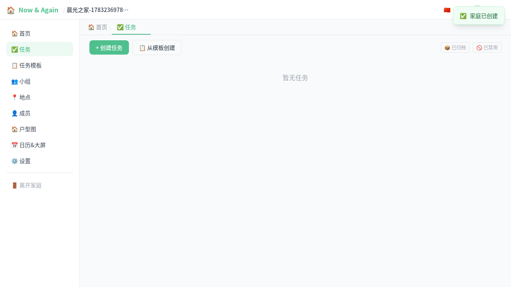
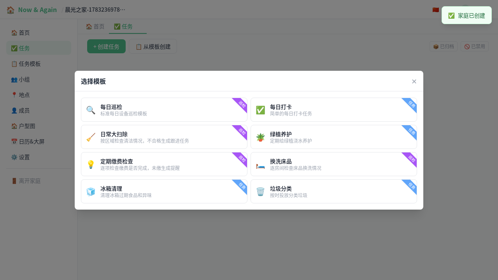
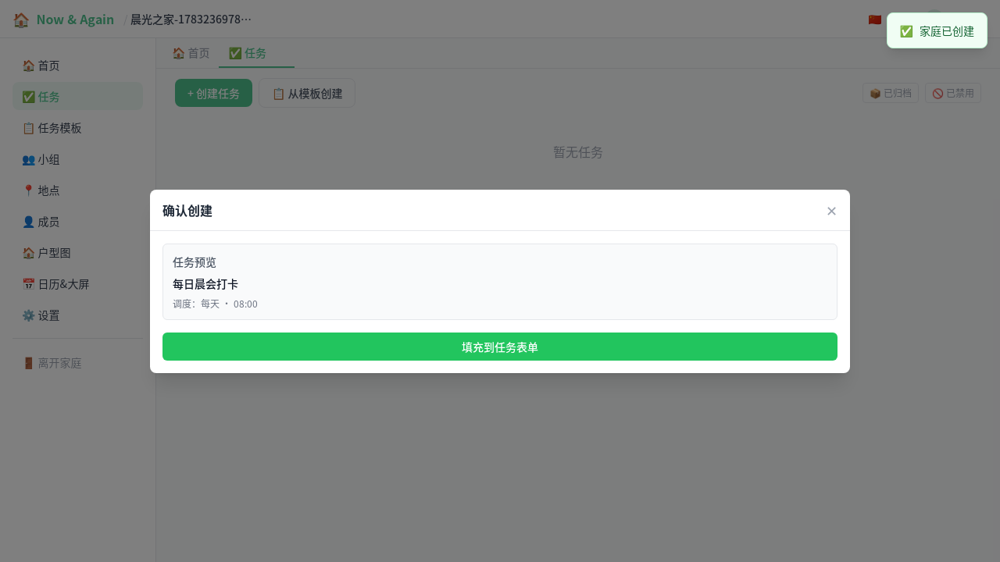
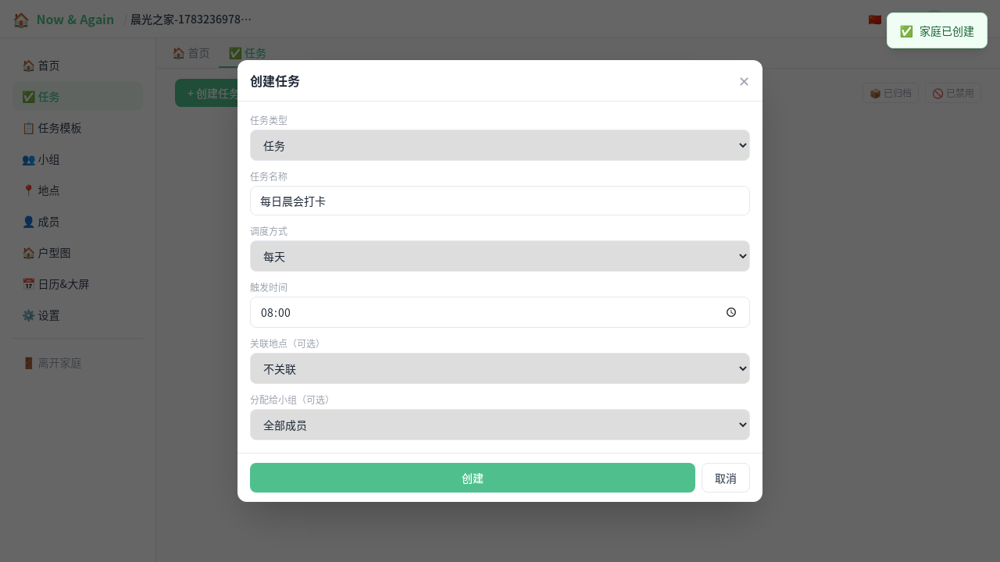
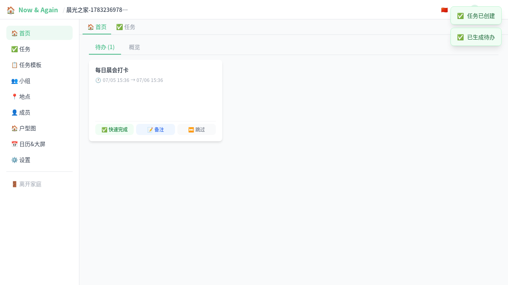
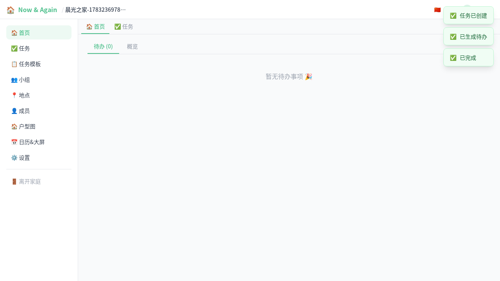

# 家庭内快速使用模板创建任务（图文）

这份文档演示一个完整流程：

1. 进入家庭
2. 从模板快速创建任务
3. 生成待办并完成事项

适合首次上手或给家人做简短培训。

## 0. 环境准备

在仓库根目录执行：

```bash
# 可选：重置数据库，获得干净演示数据
make db-reset

# 启动后端和前端
make dev
```

默认地址：

- 前端：http://localhost:5173
- 后端：http://localhost:8080

## 1. 进入家庭后打开任务页

登录后进入家庭，在左侧导航选择“任务”。



## 2. 从模板创建

点击“从模板创建”，打开模板选择弹窗。



## 3. 填写模板参数并预览

以“每日打卡”为例，填写“打卡项目”（如：晨会打卡），然后点击“预览”。



## 4. 填充到任务表单并创建

点击“填充到任务表单”后，系统会把模板渲染结果自动带入任务表单，确认后点击“创建”。



## 5. 生成待办并完成

在任务卡片点击“生成”，再到“首页”查看待办卡片并点击“完成”。



完成后，待办会从列表消失（或变为已完成状态）。



## 附：如何重新生成本文截图

本文截图由 Playwright 自动生成，用例文件：

- `test/specs/tasks/template-doc-capture.spec.ts`

执行命令：

```bash
cd test
npx playwright test tasks/template-doc-capture.spec.ts --project=chromium
```

截图输出目录：

- `doc/images/template-quickstart/`
