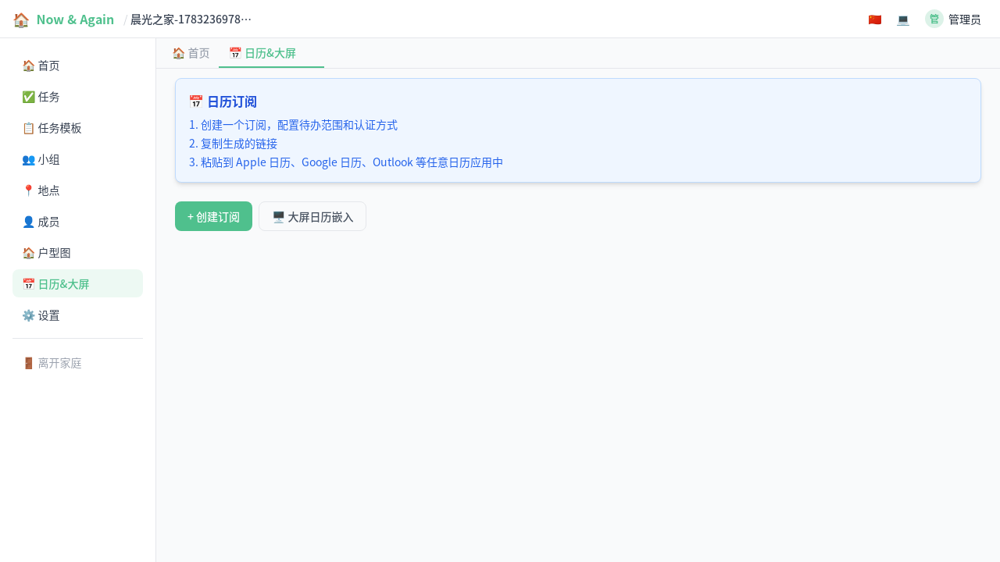
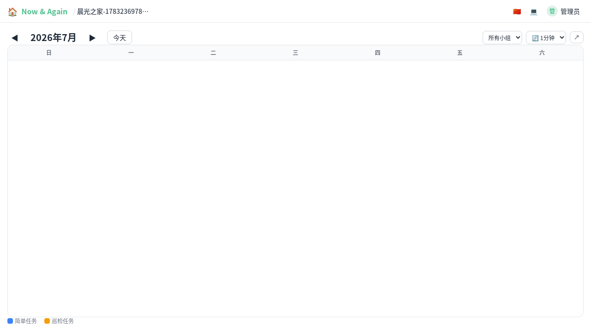

# 日历大屏与 ICS 订阅（图文）

> 通过日历视图一目了然全家的任务安排，还支持嵌入大屏和导入到手机日历 App。

---

## 1. 配置 ICS 订阅源

在"日历"标签页可以管理 ICS 订阅源。每个订阅源是一个标准的 iCalendar 地址，支持：

- **API Key 认证**：安全的机器对机器访问
- **Basic Auth**：用户名 + 密码
- **公开访问**：无需认证
- **过滤天数**：控制同步范围



配置后可以将订阅地址导入到手机日历 App（如 Apple 日历、Google 日历、Outlook 等）中查看。

## 2. 日历大屏视图

点击"日历"标签以全屏模式打开日历。适合挂在电视或投影上作为家庭信息大屏。

日历支持：

| 功能 | 说明 |
|------|------|
| 📅 月视图 | 按任务类型颜色区分（简单=蓝 / 巡检=琥珀 / 任务链=紫） |
| 🔄 自动刷新 | 30 秒/1 分钟/2 分钟/5 分钟，也可关闭 |
| 👥 小组筛选 | 只查看特定小组的任务 |
| 🖥️ 全屏模式 | 适合大屏展示 |
| 🔗 嵌入链接 | 通过 `?key=xxx&refresh=N` 参数直接嵌入任意网页 |



## 3. 嵌入到其他网页

日历支持通过 URL 参数嵌入到任意网页：

```
http://localhost:8080/calendar?key=YOUR_API_KEY&refresh=60
```

参数说明：

| 参数 | 说明 | 示例 |
|------|------|------|
| `key` | API Key（可选） | `na_key_xxx` |
| `refresh` | 自动刷新秒数（可选） | `60` |

使用 `iframe` 嵌入：

```html
<iframe src="http://localhost:8080/calendar?refresh=60"
  width="100%" height="800" frameborder="0"></iframe>
```
