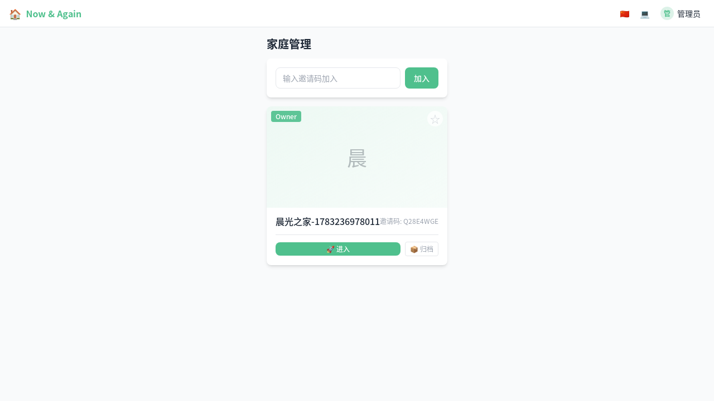
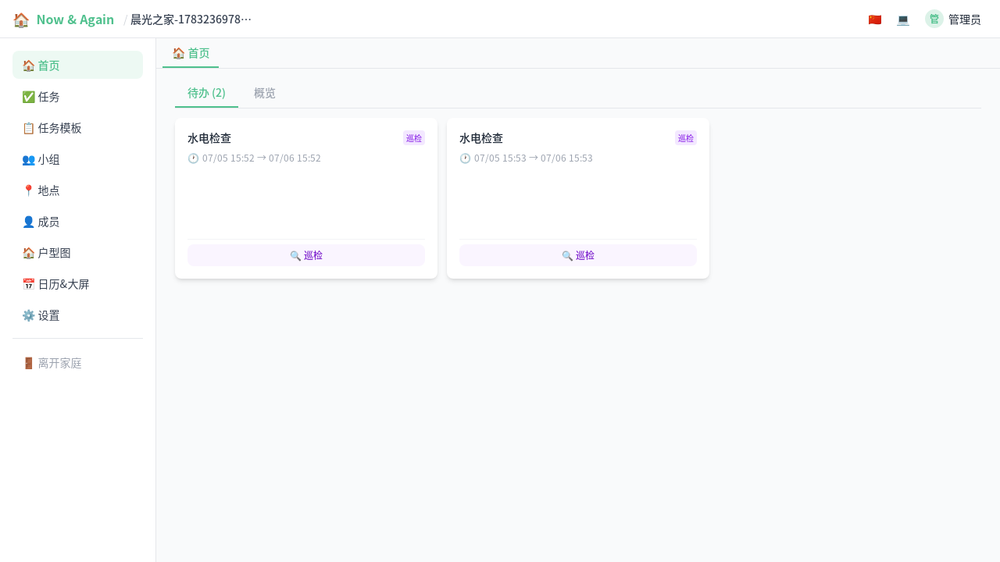
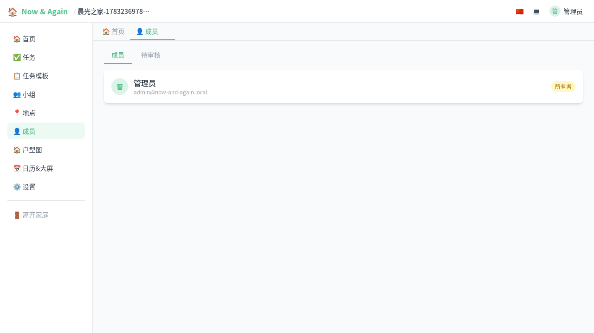

# 家庭管理入门（图文）

> 创建家庭、邀请成员、管理成员权限——让全家人用同一个家庭空间。

---

## 1. 创建第一个家庭

登录后进入家庭管理页，点击"创建家庭"。

填写家庭名称后提交，新家庭会出现在列表中。

## 2. 首页概况

进入家庭后，"首页"概览会显示：

- **待办事项**：当前需要完成的事项列表
- **概况**：成员数、小组数、家庭邀请码

将邀请码分享给家人，对方即可加入。

## 3. 管理家庭成员

在"成员"标签页可以查看所有家庭成员及其角色。

角色说明：

| 角色 | 权限 |
|------|------|
| 👑 所有者 (owner) | 全部权限，不可被移除 |
| 🔧 管理员 (admin) | 管理成员/小组/任务 |
| 👤 成员 (member) | 执行任务、使用日历 |

管理员可以：
- 将普通成员提升为管理员
- 移除成员
- 审批加入申请

