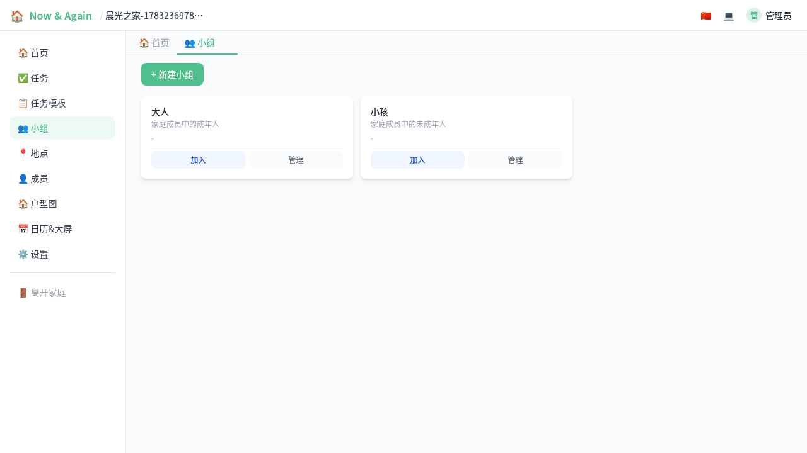
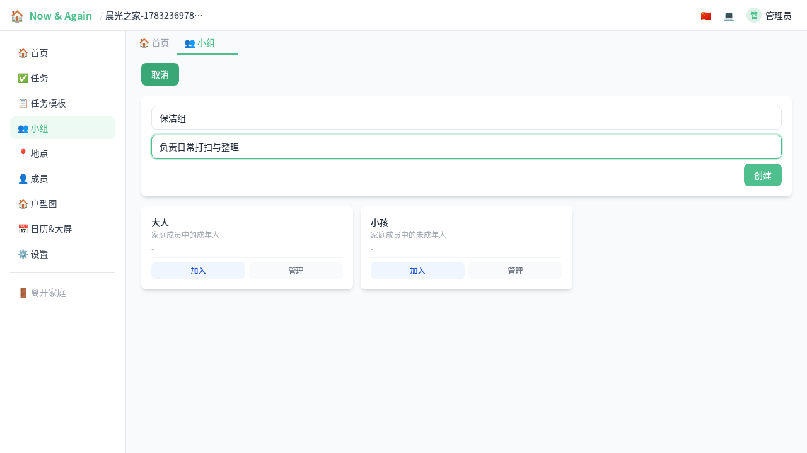
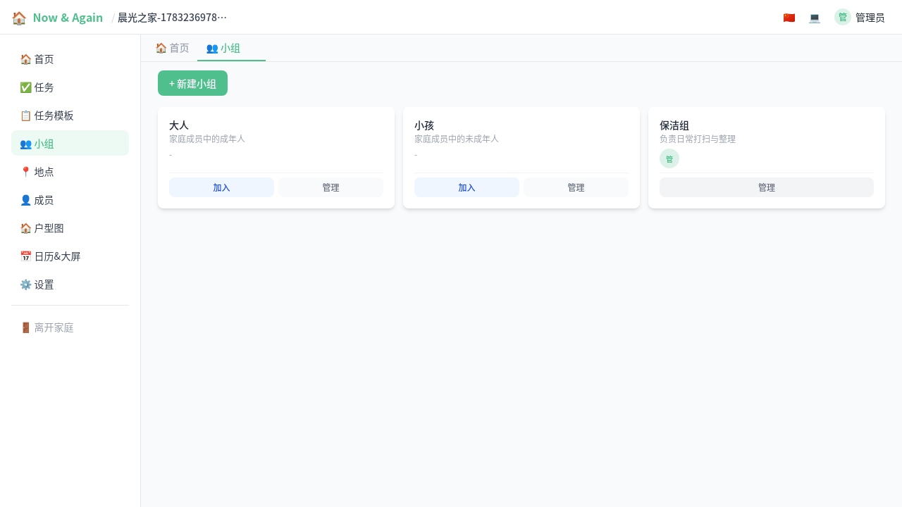

# 小组管理（图文）

> 小组用于将家庭成员分为不同职能团队，任务可以精确指派到小组。

---

## 1. 小组列表

在家庭左侧导航点击"小组"，可以看到所有已建小组。

默认系统会在家庭创建时自动生成"大人"和"小孩"两个基础小组。

每个小组卡片显示：
- 小组名称与描述
- 成员头像（左侧头像列表）
- **加入** / **离开** / **管理** 操作按钮

## 2. 创建新小组

点击"新建小组"，输入名称和描述即可创建。例如创建一个"保洁组"负责打扫任务。

## 3. 管理小组成员

小组创建者或家庭管理员可以管理成员：

- **审核加入申请**：成员申请加入时需要审核
- **移出成员**：将不再需要的人员移出
- **转让组长**：组长可指定下任组长

## 4. 在任务中使用小组

创建或编辑任务时，可以在"分配给小组"下拉中选择目标小组。这样该任务生成的待办只会分配给该小组成员，实现分工明确。
