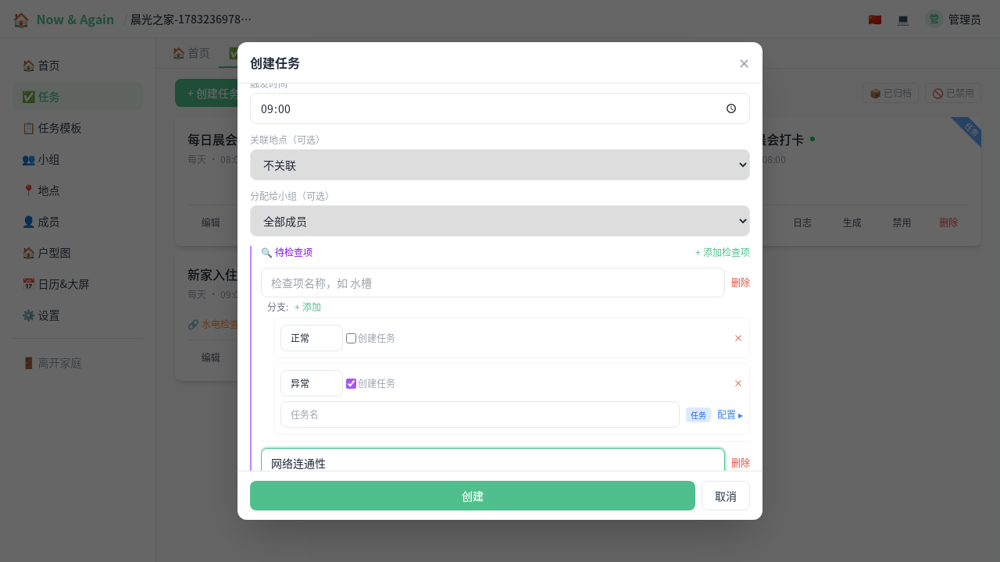
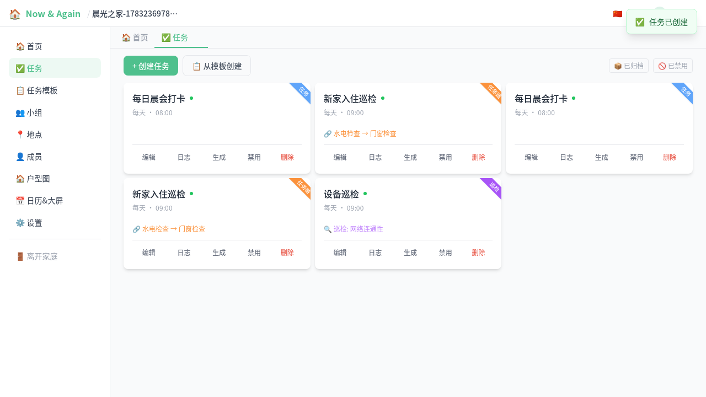
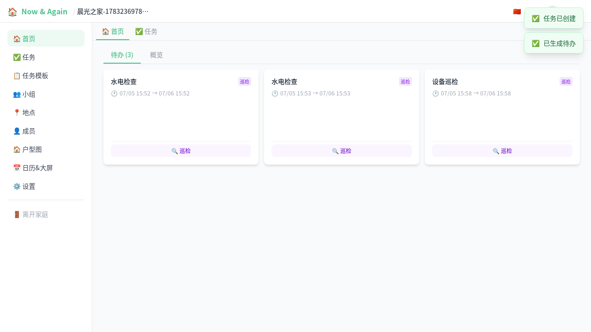
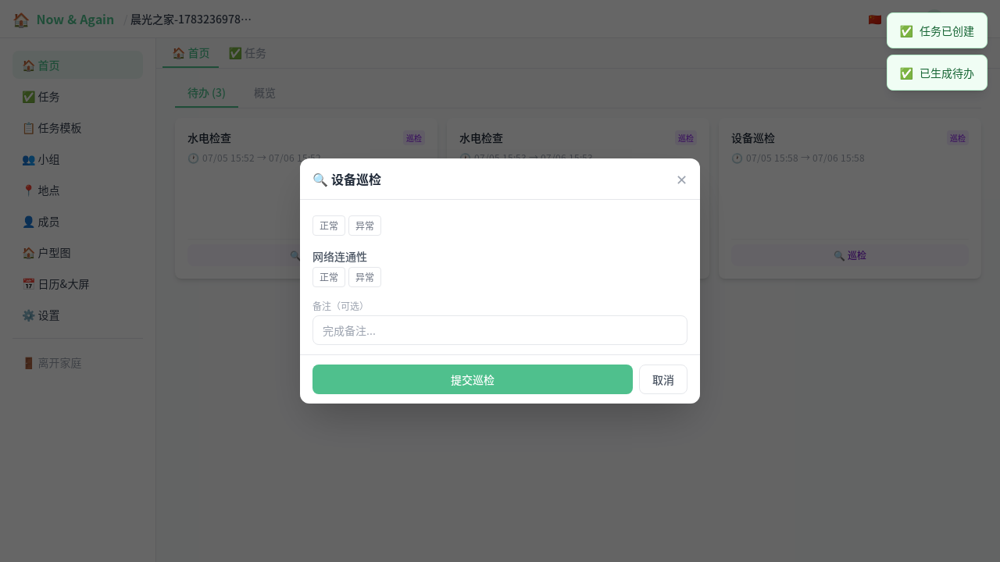
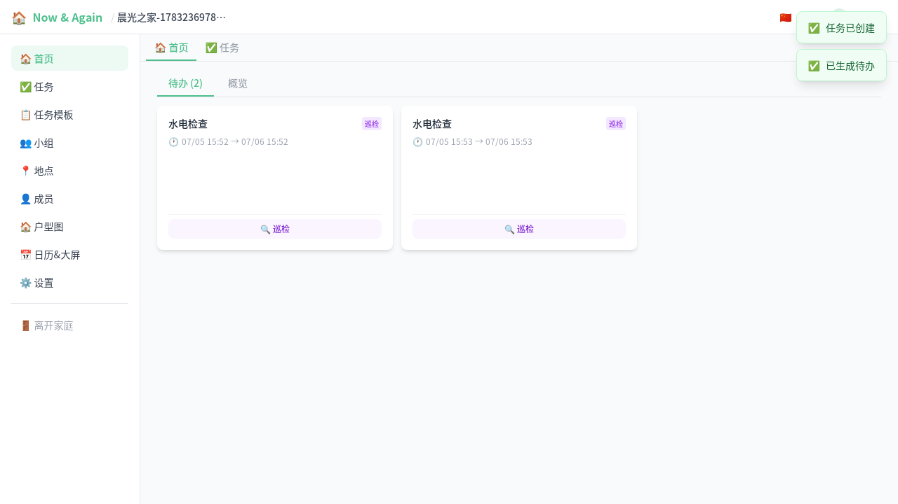

# 巡检任务使用指南（图文）

> 巡检任务适用于设备检查、环境巡查、质量检验等需要逐项确认的场景。
> 支持检查项 + 分支判定 + 异常自动跟进。

---

## 1. 创建巡检任务

在任务页点击"创建任务"，类型选择"巡检"，填写任务名称后添加检查项。

每个检查项包含：
- **名称**：如"服务器状态"、"环境卫生"
- **分支**：判定结果（如"正常/异常"、"合格/不合格"）

当检查项下有不合格分支时，还可以配置**跟进子任务**。

## 2. 巡检任务卡片

创建后的巡检任务会显示紫色角标和检查项摘要。

## 3. 触发待办并巡检

根据调度策略，系统会自动生成待办。"首页"会出现巡检待办卡片，点击"巡检"。

## 4. 逐项检查

进入巡检详情后，逐项选择判定结果。每项可标记为：

- ✅ **正常** / **合格** / **已处理** 等正向分支
- ❌ **异常** / **不合格** / **未处理** 等负向分支（可选配置跟进任务）

## 5. 完成巡检

全部检查项判定完成后，点击"提交"。巡检完成，结果自动入库。

完成后待办从列表消失，下次调度到期时会再次生成。

