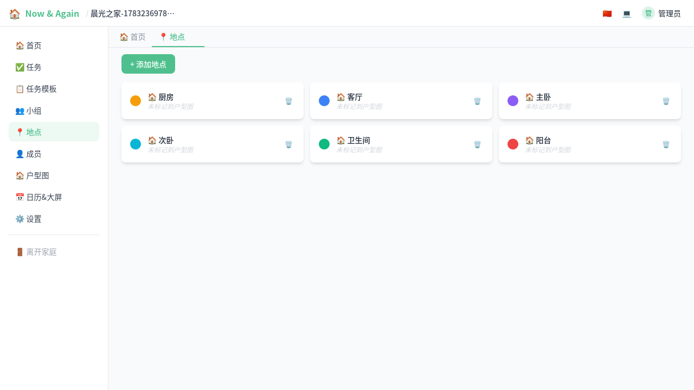
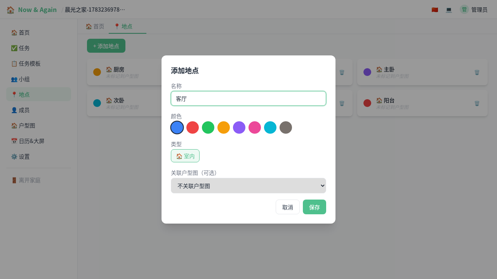
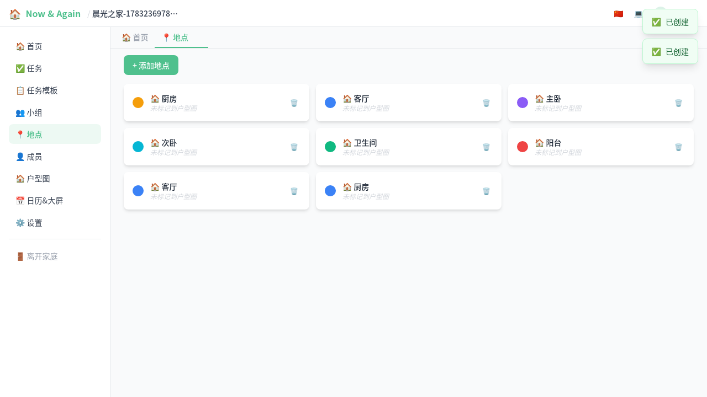

# 地点管理（图文）

> 地点是任务执行的物理位置标记，可以关联户型图，让任务安排更清晰。

---

## 1. 地点列表

在家庭左侧导航点击"地点"，进入管理页面。这里展示了所有已创建的地点。

## 2. 新建地点

点击"添加"，填写地点名称、选择颜色和类型即可。

可配置项：

| 字段 | 说明 |
|------|------|
| **名称** | 地点的名称，如"客厅"、"厨房" |
| **颜色** | 标识颜色，在任务卡片和日历中显示 |
| **类型** | 地点分类（如室内/户外），可在地点类型插件中扩展 |
| **关联户型图** | 可选，将地点标注到户型图上 |

## 3. 地点列表（已建）

地点创建后会在列表中展示，每条显示颜色圆点、名称、类型图标和户型图关联状态。

## 4. 在任务中使用地点

创建或编辑任务时，可以在"关联地点"下拉中选择已建地点。任务卡片和待办中会显示地点标记，方便按位置查看和安排。
