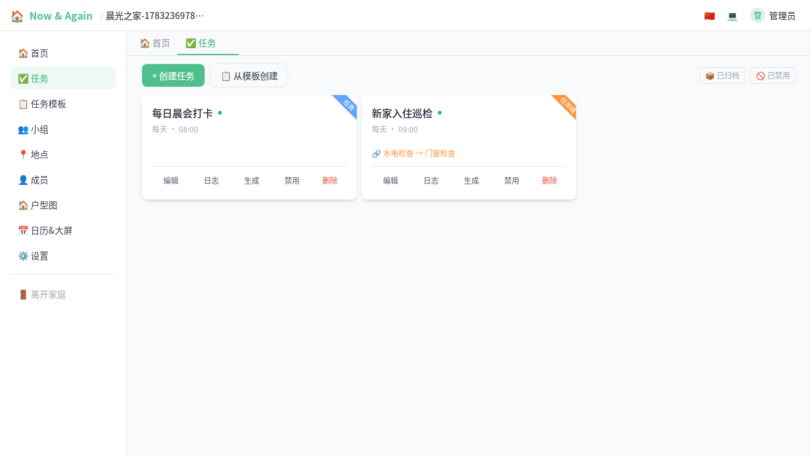
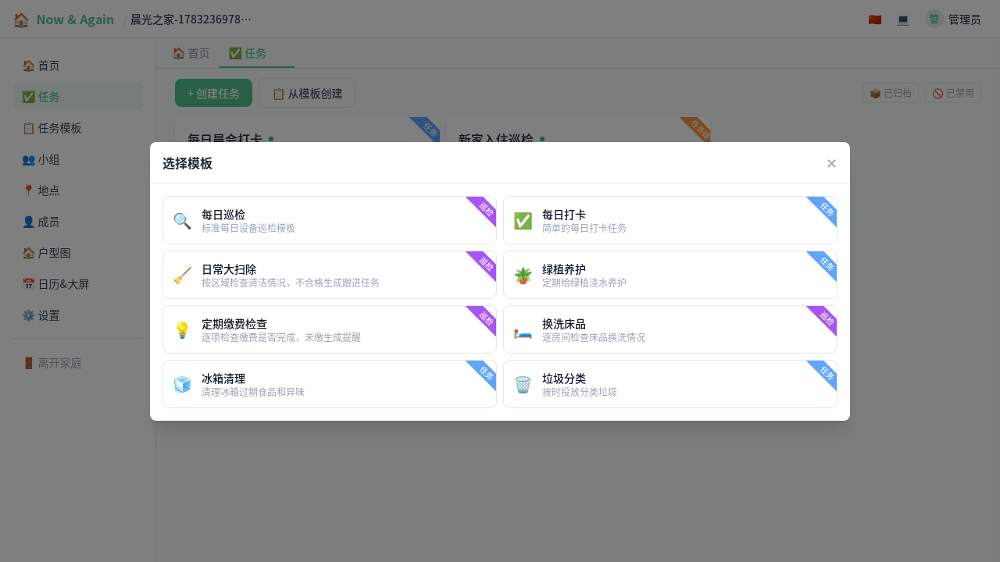
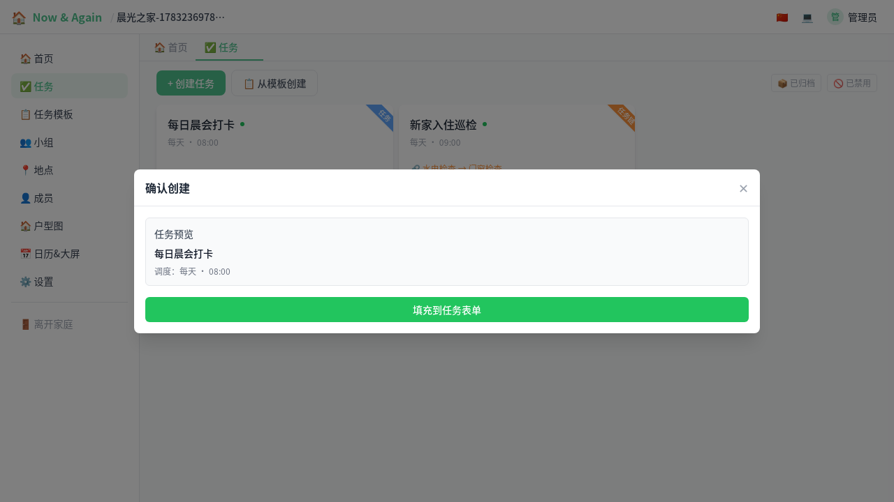
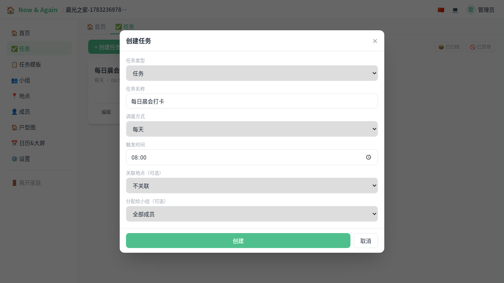
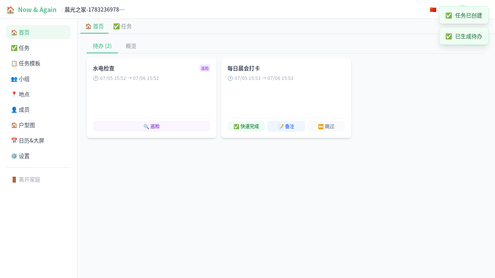
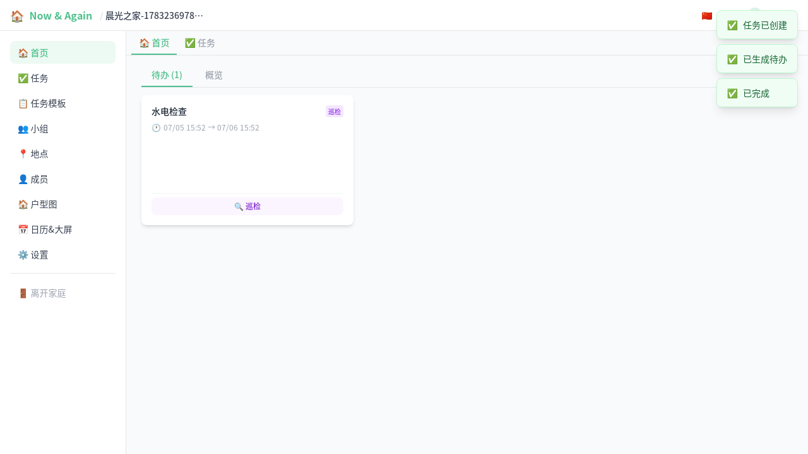
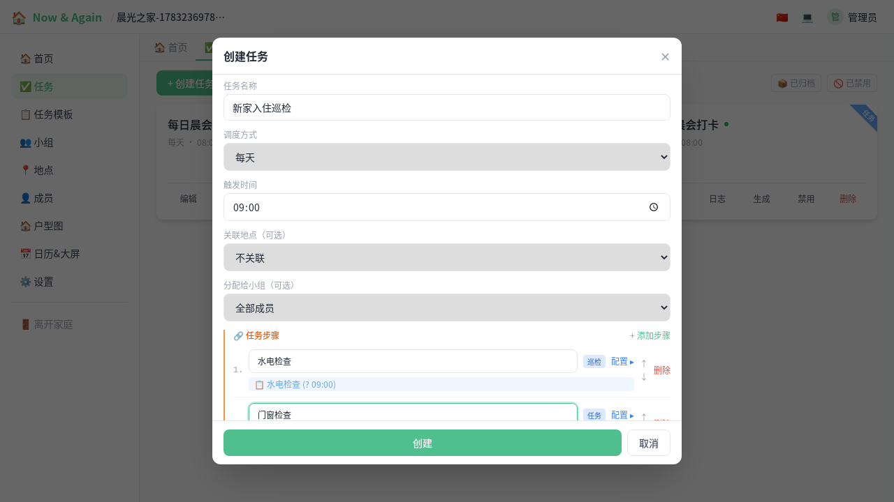
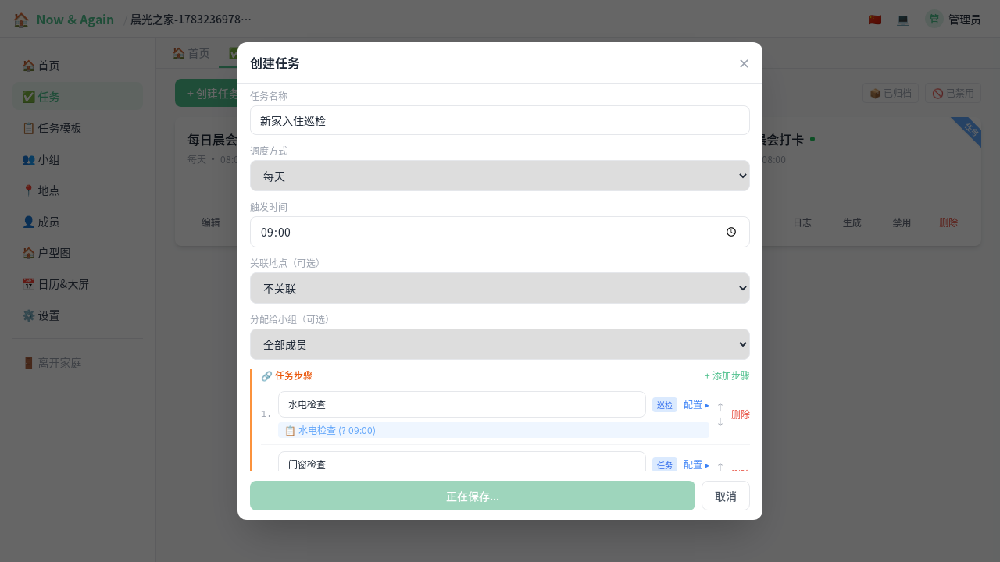
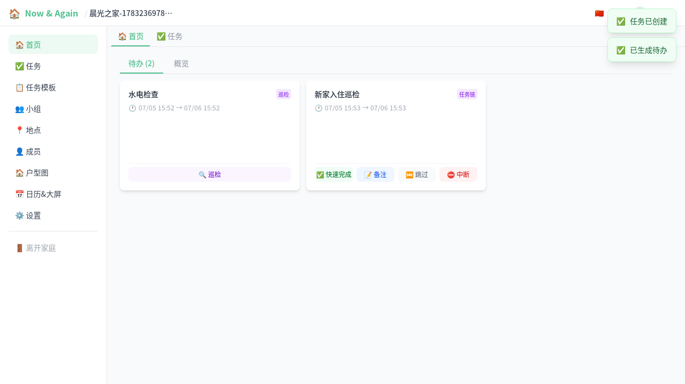
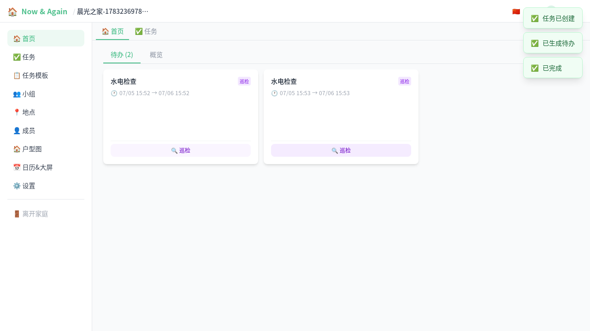

# 家庭内快速使用模板创建任务（图文）

这份文档演示一个完整流程：

1. 进入家庭
2. 从模板快速创建任务
3. 生成待办并完成事项

适合首次上手或给家人做简短培训。

## 1. 进入家庭后打开任务页

登录后进入家庭，在左侧导航选择“任务”。

## 2. 从模板创建

点击“从模板创建”，打开模板选择弹窗。

## 3. 填写模板参数并预览

以“每日打卡”为例，填写“打卡项目”（如：晨会打卡），然后点击“预览”。

## 4. 填充到任务表单并创建

点击“填充到任务表单”后，系统会把模板渲染结果自动带入任务表单，确认后点击“创建”。

## 5. 待办自动生成并完成

任务创建后，系统调度器会根据设定的调度策略（每日/每周/每月等）在到期时自动生成待办。在“首页”即可看到当前待办卡片：

点击“完成”，待办会从列表消失（下一次调度到期时会再次生成）。

## 6. 复杂嵌套任务：任务链（Chain）

对于需要多步骤串联执行的场景，可以使用“任务链”类型。每一步可用不同的任务类型，前一步完成后自动激活下一步。

### 6.1 手动创建任务链

在任务页点击“创建任务”，类型选择“任务链”，填写任务名称后添加步骤：

- 每个步骤可以设置独立名称、类型（简单任务/巡检任务）
- 巡检型步骤还可以配置检查项与分支
- 步骤顺序可以上下拖拽调整

### 6.2 任务链卡片

创建后的任务链会显示橙色角标和步骤摘要（如 `水电检查 → 门窗检查`），便于快速识别。

### 6.3 待办推进

任务链根节点的待办由调度器自动生成。根待办完成后，系统会按顺序创建下一步待办。当前待办卡片会显示：

- 任务链名称
- 当前步骤摘要
- ✅ 完成 / 📝 备注 / ⏭️ 跳过 / ⛔ 中断 四个操作按钮

### 6.4 自动推进下一步

完成当前步骤后，系统会自动激活下一步的待办：

1. 点击 ✅ 完成第一个步骤（如“水电检查”）
2. 第二个步骤（如“门窗检查”）会立即出现在待办列表中
3. 依次完成后任务链才算全部完成

